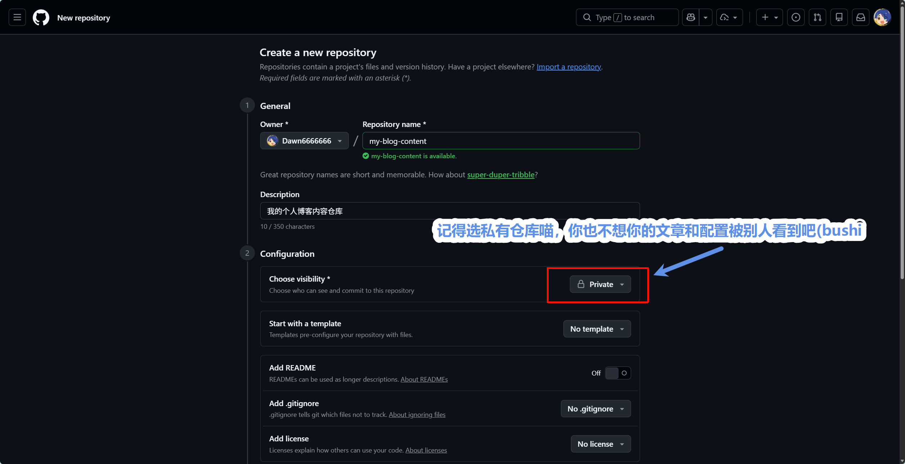
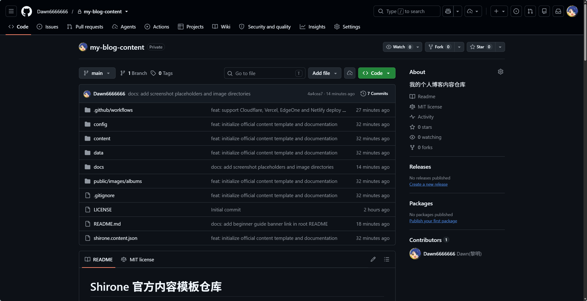

# 初始化私有内容仓库

本篇指南将手把手带你完成个人私有内容仓库的创建与首次提交。

---

## 第一步：在 GitHub 上创建私有仓库

1. 登录 [GitHub](https://github.com/) 账号；
2. 点击右上角的 **+** 号图标，选择 **New repository**；
3. 填写仓库基本信息：
   - **Repository name**：填写仓库名称，建议命名为 `my-blog-content` 或 `blog-content`；
   - **Description**：可选，填写仓库说明（例如：我的个人博客内容仓库）；
   - **Visibility**：**务必勾选 Private（私有仓库）**，以确保你的文章草稿和私人相册不被公开；
   - **Initialize this repository with**：**不要勾选**任何选项（不要勾选 Add a README file、Add .gitignore 或 Choose a license），保持完全空白；
4. 点击底部的绿色按钮 **Create repository**。



创建成功后，GitHub 会显示你的仓库克隆链接：


---

## 第二步：克隆官方内容模板到本地

打开电脑上的终端（Windows 可使用 PowerShell 或 Git Bash，macOS 使用 Terminal），运行以下命令：

```bash
# 1. 克隆官方内容模板仓库
git clone https://github.com/LyraVoid/Shirone-Content.git my-blog-content

# 2. 进入刚刚克隆下来的目录
cd my-blog-content
```


---

## 第三步：将远程地址重定向为你自己的私有仓库

在刚刚进入的 `my-blog-content` 目录下，运行以下命令：

```bash
# 将远程仓库 origin 的地址更换为你第一步创建的私有仓库地址
git remote set-url origin git@github.com:你的用户名/my-blog-content.git

# 验证远程地址是否修改成功
git remote -v
```

终端输出应显示为你个人的仓库地址：


---

## 第四步：推送首次提交到你的私有仓库

```bash
# 将模板内容推送到你的私有仓库 main 分支
git push -u origin main
```


刷新你在 GitHub 上的私有仓库页面，你将看到完整的目录结构已经全部准备就绪：



---

## 内容仓库初始目录清单

初始化完成后，你的内容仓库包含以下核心目录：

- `config/`：存放全站配置的 YAML 文件；
- `content/posts/`：存放博客文章 Markdown 文件；
- `content/moments/`：存放生活动态说说文件；
- `content/spec/`：存放“关于我”与“友链申请”页面文案；
- `data/`：存放结构化数据文件（如设备清单、音乐曲目、追番数据）；
- `public/`：存放自定义相册与直接分发的静态多媒体；
- `shirone.content.json`：内容仓库元数据标识文件；
- `.github/workflows/trigger-build.yml`：自动化构建触发流水线脚本。
