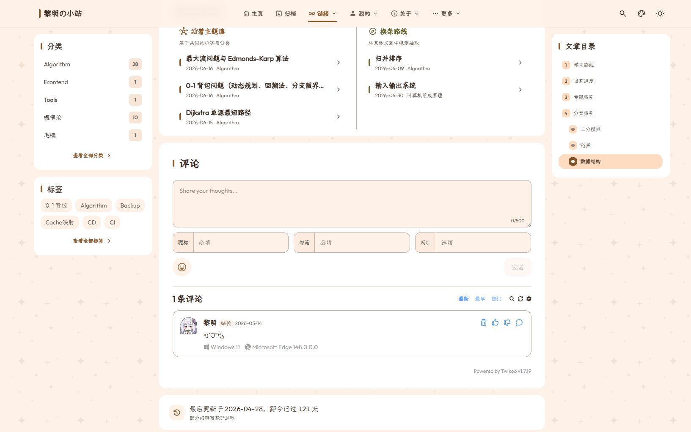

# 评论系统配置

`config/comment.yaml` 负责控制文章底部的评论互动系统。

---

## 零额外负担设计原则

为了保证极致的首屏加载速度，Shirone 严格遵循**零额外负担原则**：
- 默认状态下评论系统全局关闭（`enable: false`），**绝对不会发起任何外部网络请求，也不会生成任何多余的页面结构**；
- 开启评论后，评论组件支持**视口懒加载**：只有当访客将页面向下滚动到评论区域附近时，才会动态拉取评论脚本，保证首屏体验不受任何影响。

文章底部 Twikoo 评论区实际效果：


*图 1-1：文章详情页底部 Twikoo 评论区展示*

---

## 接入 Twikoo 评论系统

Twikoo 是一款简洁、安全、支持私有化部署和多种云托管的开源评论系统。

### 第一步：获取你的 Twikoo 环境 ID

参考 [Twikoo 官方文档](https://twikoo.js.org/) 部署好你的服务端（支持部署在 Vercel、Railway、腾讯云开发或独立服务器），获取到你的环境地址或环境 ID（例如 `https://twikoo.example.com`）。

### 第二步：修改 `config/comment.yaml`

```yaml
# 1. 开启全局评论系统总开关
enable: true

# 2. 评论服务提供商设置为 twikoo
provider: "twikoo"

# 3. 开启视口懒加载（推荐保持 true）
lazy: true

# 4. Twikoo 专有参数配置
twikoo:
  # 填入第一步获取到的环境 ID 或私有部署域名
  envId: "https://twikoo.example.com"

  # 前端脚本 CDN 地址（默认使用官方稳定版本）
  scriptUrl: "https://cdn.jsdelivr.net/npm/twikoo@1.7.19/dist/twikoo.min.js"

  # 界面语言："auto"（跟随站点语言）| "zh-CN" | "zh-TW" | "en" | "ja"
  lang: "auto"

  # 评论输入框占位提示文字
  placeholder: "欢迎留下你的想法与评论..."
```

---

## 单独关闭某篇文章的评论

如果你希望在某篇特定文章或公告中关闭评论区，无需修改全局配置，只需在该文章的顶部头部信息中加上：

```yaml
---
title: "这是一篇禁止评论的通知"
comment: false
---
```
