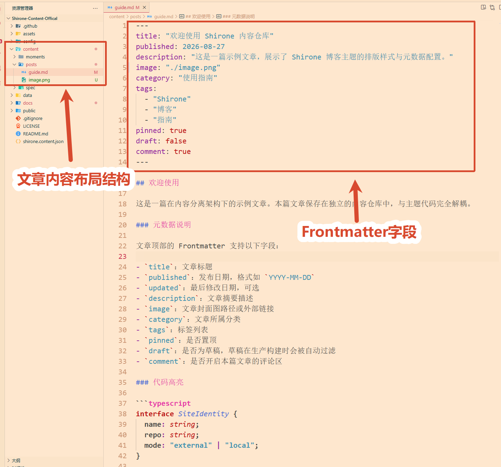
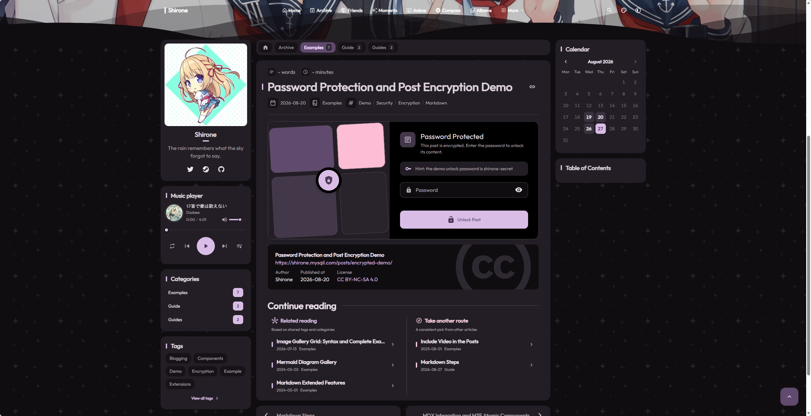
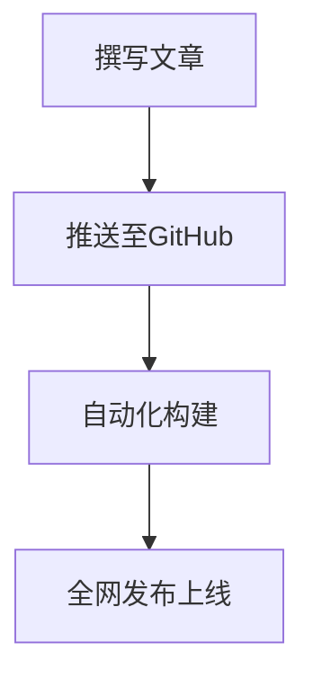

# 文章发布与排版指南

本篇文档介绍如何在内容仓库中编写与发布常规技术博客文章。

---

## 建立新文章

文章存放在内容仓库的 `content/posts/` 目录下，支持两种组织方式：

### 方式 A：单文件形式（最常用）
在 `content/posts/` 下直接新建 `.md` 或 `.mdx` 文件，例如：
`content/posts/my-first-post.md`

### 方式 B：文件夹目录形式（适合文章带有专属配图）
在 `content/posts/` 下新建一个独立文件夹，并在其中放入 `index.md` 和图片文件：
```text
content/posts/my-travel/
├── index.md
└── cover.webp
```

---

## 文章头部元数据规范

每篇文章的开头必须用三条横线 `---` 包裹一段元数据，用于定义文章标题、日期与分类：

```yaml
---
# 文章主标题（必填）
title: "我的第一篇博客文章"

# 发布日期（必填，格式如 YYYY-MM-DD）
published: 2026-08-27

# 最后更新日期（可选）
updated: 2026-08-28

# 文章摘要（可选，用于卡片简介与搜索引擎摘要，留空时自动截取正文前段）
description: "这是一篇关于现代前端技术架构与内容分离的实战总结。"

# 文章封面图（可选，支持绝对路径、相对路径或网络外链）
image: "https://example.com/cover.webp"

# 所属分类（可选，单分类）
category: "技术笔记"

# 标签列表（可选，可添加多个）
tags:
  - "Astro"
  - "前端"
  - "教程"

# 是否置顶显示在列表最前（默认为 false）
pinned: false

# 是否为草稿（设为 true 时在生产构建中自动隐藏）
draft: false

# 是否开启本篇文章的评论互动（默认为 true）
comment: true
---
```

文章详情页排版与目录跟随效果：



---

## 文章加密保护功能

如果你有一篇私人日记或不想对公众完全公开的文章，可以使用内置的**文章加密功能**：

```yaml
---
title: "这是一篇加密的个人日记"
published: 2026-08-27
category: "生活"

# 开启加密
encrypted: true
# 设置访问密码
password: "your_secret_password"
# 密码提示文字（访客在输入密码界面可见）
passwordHint: "博主最喜欢的动漫人物名字是什么？"
---
```

点击进入加密文章时弹出的密码解锁对话框：



设置后，构建期只会输出经过高强度加密的密文包，密码本身绝不会发送给浏览器。访客必须在页面弹窗中输入正确密码后，浏览器才会动态解密渲染正文。

---

## 常用排版样式支持

### 1. 代码块与语法高亮
使用标准的三反引号包裹，并写上编程语言名称：

````markdown
```typescript
interface UserProfile {
  name: string;
  role: "admin" | "author";
}
```
````

### 2. 提示与警告容器区块
主题内置五种样式的容器组件，支持使用三冒号语法直接插入：

```markdown
:::note
这是一段普通的便签提示文字。
:::

:::tip
这是一个实用的技巧提示。
:::

:::important
这是一条关键的重要信息说明。
:::

:::warning
这是一条需要注意的警告提醒。
:::

:::caution
这是一条高风险操作的危险警告。
:::
```

同时也完全兼容标准引用语法：
```markdown
> [!TIP]
> 这是一个基于引用语法的技巧提示。
```

### 3. GitHub 仓库动态卡片
使用 `::github` 行级指令，只需填入仓库路径即可自动拉取 Star、Fork、许可证和语言信息：

```markdown
::github{repo="LyraVoid/Shirone"}
```

### 4. 响应式图片画廊网格
使用 `:::grid` 容器指令可以创建多图画廊，支持自定义列数、宽高比和填充方式，并自带灯箱分组浏览：

```markdown
:::grid{columns=3 aspect="16/10" fit="cover"}


:::
```

### 5. 项目目录树
使用 `file-tree` 语言标识代码块，可以直观展示项目文件结构：

````markdown
```file-tree
- src/
  - components/
    - Header.astro
    - Footer.astro
  - content/
    - posts/
      - my-post.md
- astro.config.mjs
- package.json
```
````

### 6. 数学公式支持
使用标准的 KaTeX 语法（行内公式用单个 `$` 包裹，独行公式用双 `$$` 包裹）：

```markdown
质能守恒公式：$E = mc^2$

$$
\int_{-\infty}^{+\infty} e^{-x^2} dx = \sqrt{\pi}
$$
```

### 7. 流程图与图表绘制
使用 `mermaid` 代码块绘制流程图、时序图或架构图：

````markdown

````

### 8. 图片宽度控制与居中图注
标准 Markdown 图片支持在 Alt 文本中定义标题作为图注，也可以直接在 URL 后面增加宽度控制类名：

```markdown

```
