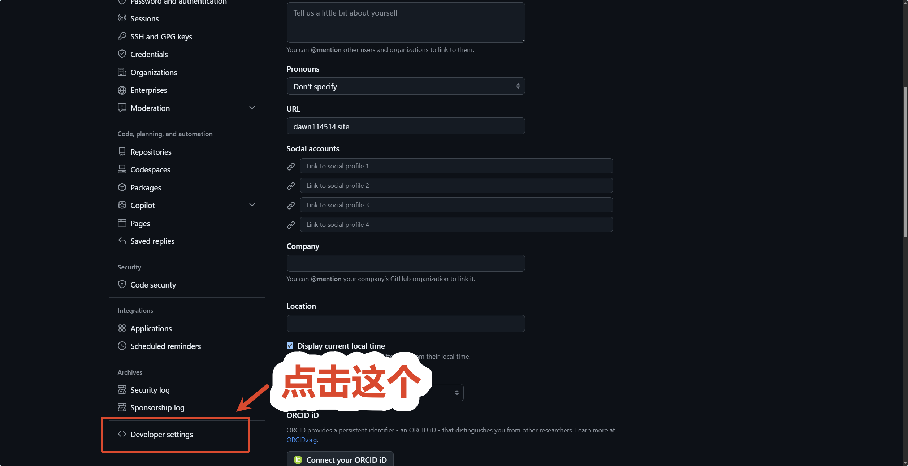
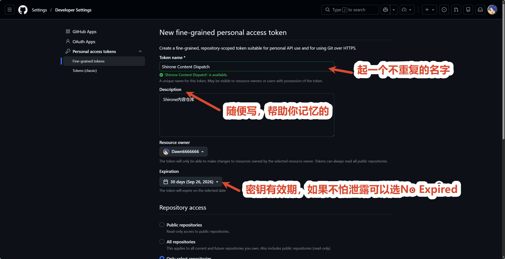
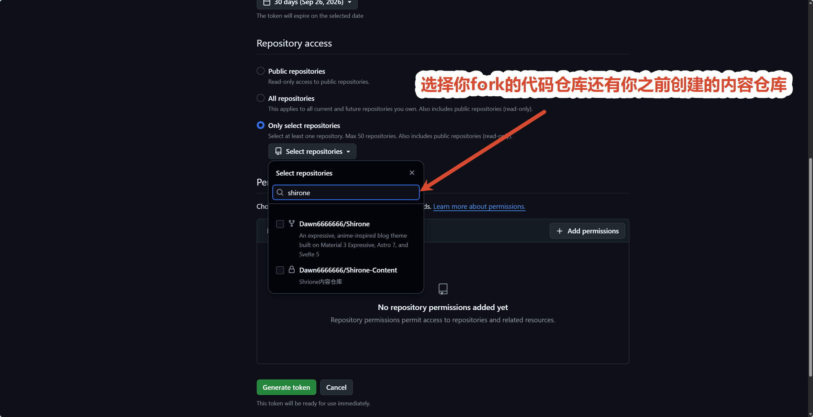
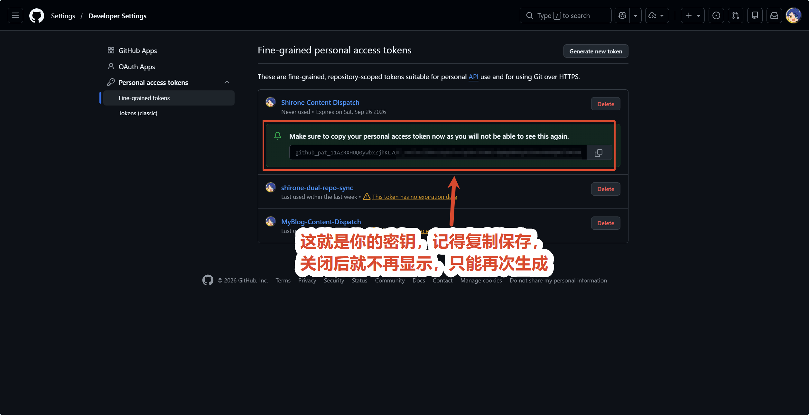

# GitHub Actions 派发模式

这是官方**最强烈推荐**的自动化部署方案。

在这种模式下，内容仓库每次推送更新，会自动通知主题代码仓库。代码仓库的 GitHub Actions 会执行完整的字体切片压缩、全量静态构建，并自动发布上线。

---

## 第一步：创建 GitHub 个人访问令牌

我们需要生成一个专用的小令牌，用来让内容仓库有权限通知代码仓库启动构建。

1. 打开 [GitHub 个人设置页面](https://github.com/settings/profile)，点击右上角头像选择 **Settings**：

   
   *图 1-1：进入 GitHub 个人账户设置*

2. 在左侧菜单栏滑动到最下方，找到并点击 **Developer Settings**：

   
   *图 1-2：进入开发者设置*

   
   *图 1-3：开发者设置导航菜单*

3. 在左侧菜单中展开 **Personal access tokens**，点击 **Fine-grained tokens**：

   
   *图 1-4：选择细粒度访问令牌*

4. 点击右上角的 **Generate new token** 按钮：

   
   *图 1-5：生成新的细粒度令牌*

5. 按以下步骤填写配置：
   - **Token name**：填写 `Shirone Content Dispatch`；
   - **Expiration**：选择过期时间（建议选择 90 天或自定义更长时间）；
   - **Repository access**：**务必选择 Only select repositories**，并在下拉列表中选中你的**主题代码仓库**（例如 `yourname/Shirone`）：

     
     *图 1-6：授权指定的主题代码仓库*

   - **Permissions**：展开 **Repository permissions**，找到 **Contents**，将其权限由 No access 改为 **Access: Read and write**（其他所有权限保持默认不选）：

     
     *图 1-7：赋予代码仓 Contents 读写权限*

6. 滑动到页面最底部，点击绿色按钮 **Generate token**，**立即复制生成的令牌字符串**（以 `github_pat_` 开头）。请妥善保管，离开页面后将无法再次查看：

   
   *图 1-8：成功生成个人访问令牌并复制*

---

## 第二步：在内容仓库中配置派发密钥

1. 打开你的**个人内容仓库**（例如 `shirone-content`）；
2. 点击顶部导航栏的 **Settings**；
3. 在左侧菜单中找到 **Secrets and variables**，点击展开并选择 **Actions**；
4. 点击页面右侧的绿色按钮 **New repository secret**；
5. 填写密钥信息：
   - **Name**：必须填入 `DISPATCH_TOKEN`（注意全大写）；
   - **Secret**：粘贴第一步中复制的个人访问令牌字符串；
6. 点击底部的 **Add secret** 保存。

> **自动化原理解析**：
> 内容仓推送新提交时，[`.github/workflows/trigger-build.yml`](.github/workflows/trigger-build.yml) 工作流会读取 `secrets.DISPATCH_TOKEN` 向你的主题代码仓派发 `content-updated` 事件。

---

## 第三步：在主题代码仓启用部署工作流

为了让主题代码仓接收到派发事件后能够自动执行构建与发布，需要在代码仓启用部署工作流：

1. 打开你的**主题代码仓库**（例如 `Shirone`）；
2. 进入目录 `.github/workflows/`；
3. 将示例工作流 `deploy.yml.example` 重命名为 `deploy.yml`（或新建该文件）；
4. 修改文件开头的环境变量配置：
   ```yaml
   env:
     # 替换为你的内容仓库路径（如 yourname/shirone-content）
     CONTENT_REPOSITORY: yourname/shirone-content
     CONTENT_WORKING_COPY: .content-src
   ```
5. **如果内容仓是私有仓库**：
   - 生成一个具备内容仓读取权限的个人访问令牌；
   - 在主题代码仓的 **Settings** -> **Secrets and variables** -> **Actions** 中添加 Secret，名称为 `CONTENT_REPO_TOKEN`，值为该令牌；
6. 提交并推送到代码仓的主分支。

---

## 第四步：验证全自动构建与发布

现在，只需在内容仓库中修改任意一篇文章并执行推送：

```bash
git add .
git commit -m "feat: 发布一篇新文章"
git push origin main
```

1. 打开内容仓库的 **Actions** 页面，你将看到 `Trigger Theme Build` 工作流被自动触发并成功派发事件；
2. 随后打开代码仓库的 **Actions** 页面，你将看到主题代码仓正在全自动拉取内容并完成编译部署；
3. 构建完成后，刷新你的博客网站，新文章即可瞬间呈现在全网。
